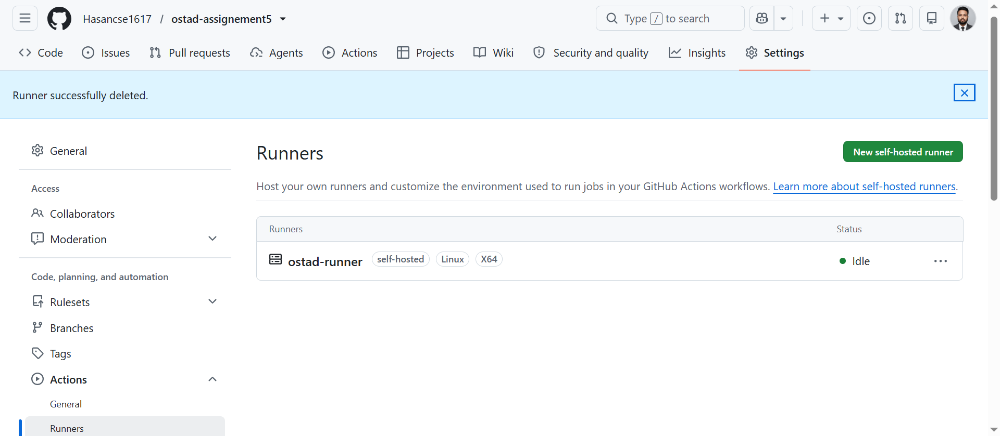
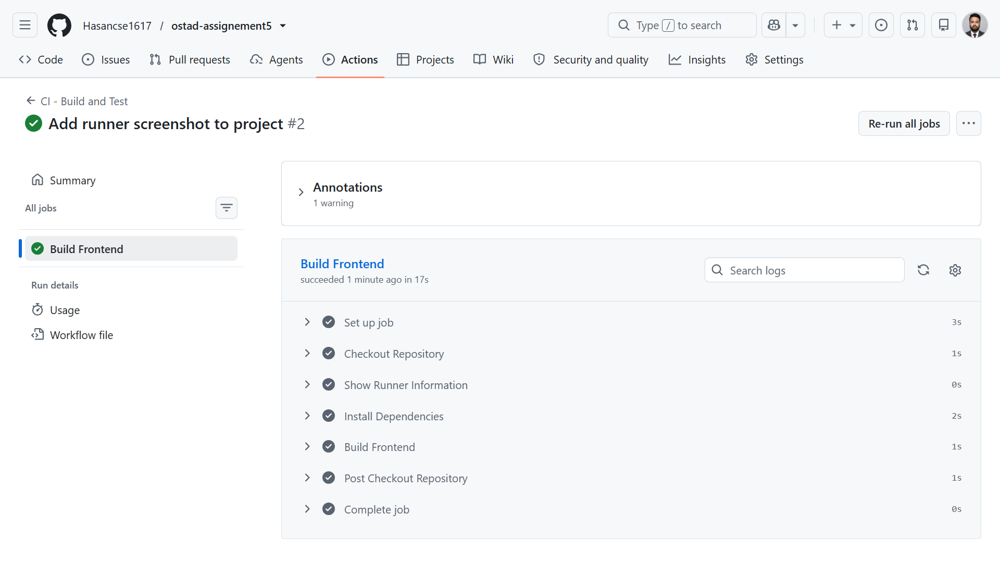

# Ostad Assignment 5 – GitHub Self-Hosted Runner

## Overview

This project demonstrates a frontend application built with **React and Vite** and a GitHub Actions CI pipeline running on a **GitHub Self-Hosted Runner**.

The self-hosted runner name is:

```text
ostad-runner
```

The project currently focuses on **Continuous Integration (CI)**.

A **Continuous Deployment (CD)** workflow has also been prepared and commented out for future use.

---

## Technologies

- React
- Vite
- Node.js
- npm
- GitHub Actions
- GitHub Self-Hosted Runner

---

## Project Structure

```text
ostad-assignement5/
│
├── .github/
│   └── workflows/
│       ├── ci.yml
│       └── cd.yml
│
├── public/
├── src/
│   ├── App.jsx
│   ├── main.jsx
│   └── index.css
│
├── screenshots/
│   └── successful-runner-job.png
│
├── index.html
├── package.json
├── package-lock.json
└── vite.config.js
```

---

## Frontend Setup

Install dependencies:

```bash
npm install
```

Run the development server:

```bash
npm run dev
```

Create a production build:

```bash
npm run build
```

---

## Self-Hosted Runner

The repository is configured with a GitHub Self-Hosted Runner.

### Runner Name

```text
ostad-runner
```

The runner is configured from:

```text
Repository
→ Settings
→ Actions
→ Runners
→ New self-hosted runner
```

The runner must be online before the GitHub Actions workflow can execute the job.

---

# CI - Continuous Integration

The CI workflow is located at:

```text
.github/workflows/ci.yml
```

The workflow runs on:

```yaml
runs-on: self-hosted
```

Therefore, the job is executed on the configured self-hosted runner.

### CI Pipeline

```text
Developer
    │
    │ git push
    ▼
GitHub Repository
    │
    ▼
GitHub Actions
    │
    ▼
ostad-runner
    │
    ├── Checkout Repository
    │
    ├── npm ci
    │
    └── npm run build
    │
    ▼
✓ Build Successful
```

---

## CI Steps

The workflow performs the following operations:

### 1. Checkout

```yaml
uses: actions/checkout@v4
```

### 2. Runner Information

The workflow displays:

```text
Runner Name
Runner OS
Node.js Version
npm Version
```

### 3. Install Dependencies

```bash
npm ci
```

### 4. Build Frontend

```bash
npm run build
```

If the build succeeds, the GitHub Actions job is marked as successful.

---

# CD - Continuous Deployment

A CD workflow has been prepared in:

```text
.github/workflows/cd.yml
```

The workflow is currently **commented out** because the current assignment focuses on successfully completing the CI pipeline.

The CD workflow can later be enabled to deploy the frontend application to a server.

Possible future flow:

```text
GitHub
   │
   ▼
CI
   │
   ▼
Build
   │
   ▼
Deployment
   │
   ▼
Production Server
```

---

# Successful Self-Hosted Runner Job

The following screenshot shows the successful GitHub Actions job executed using the required self-hosted runner:



```text
ostad-runner
```



---

## Assignment Result

```text
Frontend Project        ✓
GitHub Repository       ✓
Self-Hosted Runner      ✓
Runner Name             ostad-runner
CI Workflow             ✓
Frontend Build          ✓
Successful Job           ✓
Screenshot              ✓
CD Workflow             Prepared
```

---

## Conclusion

This project successfully demonstrates a frontend build pipeline using GitHub Actions and a GitHub Self-Hosted Runner named `ostad-runner`.

The CI pipeline performs dependency installation and a production frontend build.

The CD workflow is prepared for future deployment configuration.
